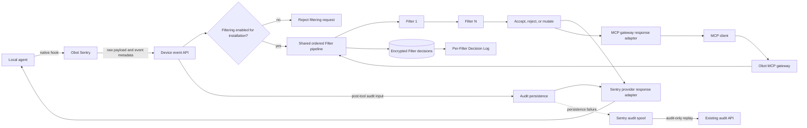

# 2026-08-14: Local agent Filters

- **Authors:** @g-linville
- **Created:** 2026-08-14

## Summary

Extend Obot Filters to protect local-agent user prompts, tool calls, and tool
responses. Obot Sentry will submit provider-native hook payloads to Obot, where
all matching device Filters are evaluated in a deterministic pipeline. For
post-tool events, the same request will also submit the existing Local Agent
Tool Call Audit Log input.

Every Filter invocation from either MCP gateway traffic or a local-agent event
is persisted as a protected decision record. Filter pages expose a Decision
Log containing non-sensitive metadata, while PII and raw decision content are
encrypted and available only to users with the Auditor role.

This design replaces the experimental MCP-server allowlist enforcement feature.
It deliberately does not make Obot Sentry resolve a local tool name to an MCP
server. Device filtering and MCP-server filtering are independent enforcement
surfaces and may both evaluate the same underlying activity.

The MCP gateway and local-agent event API use one Obot-owned Filter decision
pipeline.

## Related issues

- [obot-platform/obot#7538: Filter support for local agents](https://github.com/obot-platform/obot/issues/7538)
  drives this proposal.

## Related ODPs

None.

## Problem and motivation

Obot can currently apply Filters to MCP traffic, but a tool call made by a local
agent may execute outside Obot's MCP path. User prompts and tool responses are
also outside that path. This leaves administrators unable to apply one Filter
policy consistently at the local-agent boundary.

Obot Sentry has an experimental feature that tries to close part of this gap by
discovering local MCP configuration and enforcing an allowlist of resolved MCP
servers. That model is narrower than Filters, couples Sentry to provider and MCP
configuration details, and cannot inspect prompts or tool results. It also has
its own policy, configuration, UI, and decision-log data model.

The desired model is content-based filtering at the boundary where each local
agent exposes native hooks. Obot remains the policy authority, Obot Sentry
adapts native hook protocols, and existing Filters remain compatible.

## Goals

- Allow a Filter to target all enrolled devices and select any combination of
  `userPrompt`, `toolCallArguments`, and `toolResponse` events.
- Evaluate every matching Filter in a stable order, with accepted mutations
  feeding into subsequent Filters.
- Preserve the existing Filter invocation and result semantics so current MCP
  and HTTP-backed Filters continue to work.
- Keep populating `MCPAuditLog.WebhookStatuses` for MCP traffic.
- Keep provider-specific hook formats and response behavior at the Obot Sentry
  boundary while enforcing provider capabilities authoritatively in Obot.
- Use one Sentry-to-Obot request for post-tool filtering and audit submission.
- Fail closed when a Filter decision is unknown or rejects an event, to the
  extent the native agent hook supports control of that event.
- Preserve current audit-only behavior when local-agent filtering is disabled.
- Remove the experimental allowlist enforcement feature while orphaning its
  decision-log table.
- Add a Decision Log to each Filter, with encrypted PII and raw data visible
  only to Auditors.
- Use one decision pipeline for MCP gateway and local-agent traffic without
  coupling it to either transport.
- Record decisions for Filter invocations from both MCP gateway traffic and
  local-agent events.

## Non-goals

- Resolving local tool names to MCP servers in Obot Sentry or Obot.
- Selecting individual devices as Filter targets.
- Administrator-defined Filter priority or parallel Filter execution.
- Defining a new versioned payload contract visible to Filters.
- Adding mutation support to HTTP-backed Filters.
- Guaranteeing enforcement for native-agent events that have no hook, or whose
  hook cannot reject or safely suppress the original content.
- Persisting raw Filter data outside the encrypted sensitive fields of the new
  Filter decision table.
- Exporting Filter decisions in the first release.
- Preserving application access to the experimental enforcement decision log
  or its configuration.

## Context and constraints

Filters are represented as `MCPWebhookValidation` resources. Existing targets
select MCP servers, catalog entries, or catalogs. Existing Filter MCP tools
accept a legacy argument object containing `accept`, `mutated`, `message`, and
`reason`, and return decisions using the same fields. HTTP-backed Filters adapt
this interface by forwarding `message` as the webhook body and interpreting the
HTTP status code as accept or reject.

The MCP Filter path is entirely Obot-owned. `WebhookHelper` selects matching
Filter resources, `ServerHookConfig` resolves hook tool/server configuration,
`SessionManagerHookRunner` calls Filter tools through the official Go MCP SDK,
and `mcpgateway.hookProcessor` applies decisions at the reverse-proxy boundary.
The gateway also owns JSON-RPC/SSE framing, response correlation, mutation
metadata, and the `MCPAuditLog.WebhookStatuses` projection. `mmmcp` handles
composite MCP aggregation only.

Obot Sentry already installs native local-agent hooks and submits post-tool
events to Obot's Local Agent Tool Call Audit Log. It also spools audit records
when delivery fails, using an idempotency key already present on each record.

Native hook capabilities differ across Claude Code, Codex, Cursor, and VS Code.
Some events can be rejected, some tool inputs or results can be replaced, and
some failures cannot be intercepted at all. Prompt replacement is not supported
by the initial provider set. These capabilities change over time and cannot be
trusted solely from a client request.

Raw local-agent payloads may contain secrets and sensitive user or tool data.
The new Filter decision table is the only new persistence path for prompt and
pre-tool payloads. Those payloads, mutations, Filter outputs, reasons, PII, and
detailed source context are encrypted and readable only by Auditors. The
existing audit log retains its current schema and meaning.

## Proposed design

### System boundaries



The boundaries are:

- The local agent owns the native hook event and the mechanisms available to
  block or replace its content.
- Obot Sentry preserves the raw native payload, reports event metadata, builds
  the existing audit input where applicable, and translates Obot's normalized
  decision back into the native response protocol.
- The Obot MCP gateway retains proxy framing, SSE handling, request/response
  correlation, MCP identity extraction, wire responses, mutation metadata, and
  `MCPAuditLog.WebhookStatuses`. It delegates Filter invocation and decision
  normalization to the shared pipeline.
- Obot's local-agent API authenticates the device and MDM configuration,
  applies authoritative provider capabilities, delegates to the same pipeline,
  and persists the local-agent audit record.
- A Filter sees only its legacy argument object. It does not receive device
  identity, provider capability metadata, or a new local-agent envelope.

### Filter targeting

A Filter may add an all-devices target distinct from the existing all-MCP-
servers target:

```json
{
  "resources": [
    {"type": "deviceSelector", "id": "*"}
  ],
  "localAgentEvents": ["*"]
}
```

The device target requires at least one local-agent event, and local-agent
events are invalid without a device target. `*` selects `userPrompt`,
`toolCallArguments`, and `toolResponse` and cannot be combined with explicit
event values. Explicit values select a subset. `toolResponse` includes both
successful and failed tool execution when the provider exposes those events.
Individual device selection is not part of this design.

Device targets and MCP targets are independent. A Filter containing both is
eligible once when a matching local event reaches the device API and separately
when matching MCP traffic reaches Obot. Obot Sentry does not infer that a local
tool call belongs to any particular MCP server. The resulting double evaluation
is intentional because the two evaluations protect different boundaries.

### Event transport and trust model

Obot exposes one device-authenticated event API for prompt, pre-tool, and
post-tool events. Its transport object is private to the Obot/Sentry boundary;
it is not forwarded as the Filter input. It conveys:

- local-agent provider and exact native hook event;
- normalized surface: `userPrompt`, `toolCallArguments`, or `toolResponse`;
- request, response, or failure phase;
- unmodified provider-native JSON payload;
- raw tool name and correlation fields when the provider supplies them;
- Sentry's claimed reject and mutate capabilities; and
- an optional existing Local Agent Tool Call Audit Log input for post-tool
  events.

The device JWT is authoritative for device and MDM configuration identity.
Client-supplied identity fields are ignored or rejected. Obot verifies the
installation has filtering enabled and checks the provider, event, and claimed
capabilities against a server-owned capability table. Client capability claims
can narrow behavior but cannot grant capabilities.

The response reports two independent results:

- a known Filter decision of accept, reject, or mutate, with an optional
  complete replacement and bounded reason; and
- whether the optional audit record was stored or must be spooled.

A known Filter decision is returned even if audit persistence fails. Policy and
infrastructure rejection are decision outcomes rather than transport errors.
Authentication, authorization, unreadable top-level requests, and failures that
prevent Obot from returning a trustworthy decision are transport failures.

Payload-heavy requests use compression and a decoded-body limit. A request that
cannot be authenticated or decoded has no trustworthy Filter outcome and is
handled fail-closed by Sentry. For a post-tool event, Sentry also spools its
audit record.

### Filter decision pipeline

Obot separates Filter execution from source-specific selection and validation.
The reusable decision pipeline accepts a raw JSON payload, matching Filter
resources, mutation permissions, source capabilities, and a source-specific
mutation validator. It returns one normalized accept, reject, or mutate result.

The shared implementation has three parts:

- a candidate resolver returns configured Filter resource identity, tool/server
  configuration, and mutation permission in internal-resource-name order;
- the single-Filter executor accepts `json.RawMessage` while using
  `SessionManagerHookRunner` and its official Go MCP SDK call path to preserve
  the legacy Filter argument shape; and
- the ordered pipeline invokes candidates, normalizes output, validates
  mutations through the source adapter, and records each effective decision.

MCP candidate selection uses the server, catalog entry, catalog, and wildcard
indexes in `WebhookHelper`. Local-agent candidate selection uses the
`device-selectors` index and `localAgentEvents`. Both exclude disabled or
unconfigured resources and de-duplicate a Filter reached through more than one
matching target.

For each event, Obot:

1. selects all enabled and configured Filters matching the event's target and
   surface;
2. sorts them by their internal resource name in ascending order;
3. invokes them sequentially;
4. feeds each accepted complete mutation to the next Filter; and
5. stops at the first rejection or execution failure.

A Filter is invoked at most once for an event even if multiple selectors match.
No matching Filters means accept unchanged. Ordering is not administrator
configurable in this design. Stable resource-name ordering preserves the
current Obot MCP behavior while retaining all distinct matching Filters.

Each Filter MCP tool receives the legacy argument shape:

```json
{
  "accept": true,
  "mutated": false,
  "message": {"provider-native": "payload"},
  "reason": ""
}
```

`message` is the raw JSON object or value, not serialized JSON inside a string.
For later Filters, `message` contains the payload after all prior accepted
mutations. No version discriminator, source envelope, device context, or
capability object is added.

Responses are normalized as follows:

| Filter response | Pipeline result |
| --- | --- |
| `accept=true`, `mutated=false` | Accept current payload |
| `accept=false` | Reject |
| `accept=true`, `mutated=true`, complete `message` present | Candidate mutation |
| Malformed, contradictory, timed out, or errored response | Reject as infrastructure failure |

Structured MCP output and the existing single-text-content JSON fallback remain
supported. HTTP-backed Filters remain accept/reject-only: the current adapter
continues to send `message` as the raw request body, accept 2xx responses, and
reject non-2xx or transport failures. It does not interpret response bodies as
mutations.

The MCP gateway's `hookProcessor` is an adapter around this pipeline. It owns
JSON-RPC and SSE parsing, compression/size limits, `MCPHookCorrelation`, MCP
error responses, hook mutation metadata, and `MCPAuditLog.WebhookStatuses`.
The pipeline result includes the ordered outcome information needed by the
gateway's existing status projection. The gateway retains its status-emission
rules and the established field meanings for accepted, mutated, and rejected
outcomes. The new decision recorder must not remove, replace, or reduce this
audit-log projection.

The shared pipeline stops at the first rejection or infrastructure failure;
later Filters are not invoked and therefore produce neither webhook statuses
nor decision rows.

### Mutation safety

A mutation is a complete replacement of the native payload, not a patch. Obot
accepts a candidate mutation only if:

- the Filter is administratively allowed to mutate;
- the server capability table permits mutation for that provider and event;
- the replacement parses as the same provider/event shape; and
- provider, event, tool, protocol, session, turn, tool-use, and other identity
  or correlation fields remain unchanged.

Only the content field appropriate to the event may change, such as tool input
or tool result. Sentry validates the replacement again before encoding a native
response. A disallowed or invalid mutation becomes a rejection; the original
payload is never silently released in its place.

The MCP adapter supplies JSON-RPC identity validation, and the local-agent
adapter supplies provider/event identity validation. Neither source's HTTP or
native-hook transport object is part of the shared pipeline.

### Decision persistence

The pipeline records one `MCPWebhookValidationDecision` row after each invoked
Filter result is normalized and any candidate mutation is validated.

All rows from one pipeline call share an opaque `EvaluationID`; `Sequence`
records execution order. Non-sensitive columns include Filter resource ID, a
snapshot of its display name, `Source` (`mcp` or `localAgent`), event, phase,
effective decision, policy/infrastructure kind, duration, and a bounded error
class. Sensitive context, input, raw Filter output, mutation, reason, and
diagnostics are kept in encrypted fields. The Filter resource ID is the durable
lookup key, with no cascading foreign key, so deleting a Filter does not delete
retained history.

### Decision Log API and UI

Add Filter-scoped, read-only endpoints for a paginated metadata list and a
single decision detail:

- `GET /api/mcp-webhook-validations/{filter_id}/decisions`
- `GET /api/mcp-webhook-validations/{filter_id}/decisions/{decision_id}`

List queries select only non-sensitive columns. Detail queries select and
decrypt sensitive fields only for callers for whom `UserIsAuditor()` is true.

The Filter detail page adds a `Decision Log` tab distinct from `Audit Logs`.

### Provider capabilities and coverage

Obot and Obot Sentry maintain matching, table-driven capability definitions for
the supported provider events. The initial design follows these principles:

- all four providers can reject a user prompt, but none can mutate it;
- supported pre-tool hooks may reject and may replace complete tool input;
- post-tool rejection or replacement is enabled only where the pinned provider
  version can prevent the original result from reaching the model; and
- missing or observational-only failure hooks are explicit coverage gaps.

Obot does not invoke a device Filter for an event that the authoritative table
says cannot reject or safely suppress the original. Existing audit submission
may still proceed. This avoids reporting policy enforcement where Sentry cannot
apply a rejection.

A gap in one event does not disable supported events for that provider. Agent
versions and coverage gaps are visible to administrators, and each enabled
adapter is backed by conformance fixtures for its minimum supported version.

### Failure and audit semantics

Selected Filter timeouts, invocation errors, malformed results, invalid
mutations, and unknown Obot outcomes fail closed. Sentry uses the narrowest
native rejection mechanism available so that only the current prompt, tool
call, or tool result is blocked when possible. It terminates the agent only when
that is the provider's sole reliable fail-closed mechanism.

Filter evaluation and audit persistence have independent outcomes after request
authentication and decoding:

| Filter outcome | Audit outcome | Sentry behavior |
| --- | --- | --- |
| Accept or mutate | Stored | Apply decision; do not spool |
| Accept or mutate | Failed | Apply decision; spool audit |
| Reject | Stored | Reject event; do not spool |
| Reject | Failed | Reject event; spool audit |
| Unknown due to transport failure | Unknown | Reject event; spool audit |

Therefore, an audit storage failure does not block content that Filters are
known to have accepted. Conversely, successful audit persistence does not
override a Filter rejection.

Failure to encrypt or persist a Filter decision is an infrastructure rejection
and stops later Filter execution. It remains independent of the optional
tool-call audit outcome.

The audit input always describes the original, pre-filter tool result or
failure. Mutations affect what the model receives, not the audit record. Sentry
reuses the audit record's existing idempotency key. Spool replay uses only the
existing audit API and never reruns Filters, because a later policy decision
could differ from the decision made inline.

### Data protection and observability

Raw MCP messages, prompts, pre-tool payloads, tool responses, mutations, and
Filter outputs may be stored only in encrypted sensitive fields of the Filter
decision table. They are not stored in other database rows, application logs,
access logs, debug output, errors, metrics, or traces. The existing MCP and
local-agent audit schemas remain unchanged. Mutated payloads, Filter reasons,
and raw Filter outputs are not added to those audit records.

Decision rows use the MCP audit-log retention setting.

Operational telemetry contains metadata only: Filter resource identifier,
surface, duration, decision class, bounded error class, timeout, capability
mismatch, audit result, and spool action. User-visible infrastructure reasons
are bounded and generic; Filter-provided policy reasons are also bounded before
being returned through a native hook.

### Configuration

An installation-level `FiltersEnabled` setting, defaulting to `false`, controls
whether Obot Sentry installs Filter hooks. Obot also stores and checks this
setting for the enrolled MDM configuration so a device cannot opt itself into
content filtering merely by calling the event API.

When disabled, Sentry installs only the existing audit hooks and preserves their
current behavior. When enabled, it installs supported prompt, pre-tool, and
post-tool hooks. A post-tool event runs one managed command and makes one request
for filtering and audit submission; it does not run a second audit command.

`FiltersEnabled` is intentionally unrelated to the old `EnforcementEnabled`
setting. Old MDM, environment, or command-line enforcement values do not enable
Filters. During convergence, Sentry removes old managed enforcement hooks while
preserving unrelated third-party hook configuration.


## Trade-offs

Sequential evaluation and fail-closed behavior favor deterministic security
over latency and availability. A slow or unhealthy selected Filter can block an
event, so calls and the overall pipeline require bounded time budgets and
metadata-only health signals.

Provider-native payloads preserve compatibility and full event fidelity, but
make mutation validation provider-specific. Keeping capability tables in Obot
and Sentry duplicates a small amount of knowledge; in return, Obot remains the
authority and Sentry can safely encode native responses at the device boundary.

Independent device and MCP targeting is explicit and avoids unreliable
resolution, but administrators may see the same activity evaluated twice.
Documentation and UI language must explain that targets represent enforcement
surfaces rather than mutually exclusive identities.

Orphaning the experimental decision table avoids destructive data loss but
leaves unused data in the database. The old feature remains unavailable because
its code and product surfaces are removed.

Persisting every invoked Filter provides an explainable enforcement history,
including for existing MCP traffic, but increases database volume and places
sensitive prompts and tool data at rest. Encryption, column omission, retention
cleanup, authorization tests, and data minimization are therefore part of
correctness rather than optional hardening. Because storage failure fails
closed, database health becomes part of inline Filter availability for both MCP
and local-agent traffic.

## Risks

- Some post-tool failures cannot be intercepted. These are coverage gaps, not
  fail-open decisions, and must be visible to administrators.
- Migrating the existing MCP hook loop changes it from collecting multiple
  errors to stopping at the first terminal decision. Existing MCP proxy,
  correlation, mutation, and audit fixtures must gate that refactor.

## Rollout and migration

Rollout is staged across Obot and Obot Sentry:

1. Obot gains the device target model, refactors the existing MCP hook loop onto
   the shared decision pipeline, activates protected MCP decision recording,
   and adds the Decision Log UI. Proxy/SSE/correlation and existing MCP audit
   behavior remain in the gateway.
2. Obot adds disabled-by-default local-agent configuration and the device event
   API on the same pipeline while old enforcement remains operational.
3. A new Obot Sentry release gains provider adapters, the unified event client,
   audit spooling behavior, `FiltersEnabled`, and hook convergence. It removes
   its allowlist resolver and old enforcement command.
4. After signed Sentry packages are available and upgrade convergence is
   validated, Obot exposes the new configuration and removes the old
   enforcement product surface.
5. For one release, the authenticated legacy enforcement-decision endpoint
   remains as an allow-only tombstone. It performs no evaluation or persistence
   and prevents old fail-closed hooks from blocking every tool call during the
   upgrade window.
6. The tombstone is removed in the following release after the supported Sentry
   upgrade window.

The migration drops the old enforcement configuration columns but leaves the
experimental decision-log table and its rows untouched. The table is orphaned:
all evaluator, API, UI, persistence, export, and cleanup paths are removed.

`FiltersEnabled` defaults to false and does not inherit or alias any old
enforcement setting. An upgraded installation therefore converges to current
audit-only behavior until an administrator explicitly enables Filters. Turning
Filters off is the operational rollback for the new path; rollback to the old
allowlist feature is intentionally unsupported after destructive cleanup.

The ordering is a safety requirement: Obot must not remove active enforcement
behavior before a compatible Sentry release can remove old hooks. Calls to the
temporary tombstone and metadata-only Filter failures, timeouts, capability
mismatches, and spool actions are monitored through the rollout.

## Testing and validation

The design is validated at five boundaries:

- **Filter pipeline and MCP adapter:** selection, stable ordering, mutation
  chaining, first rejection, malformed results, timeouts, duplicate selectors,
  no-match accept, legacy structured/text output compatibility, MCP identity
  invariants, and one effective decision record per invoked Filter. Existing
  JSON, gzip, SSE, cross-exchange correlation, block/mutation, mutation-metadata,
  and MCP audit-status fixtures run through the shared pipeline. Before/after
  assertions verify that `MCPAuditLog.WebhookStatuses` retains the same entries
  and field meanings for every invoked Filter.
- **Provider adapters:** raw fixture preservation and native accept, reject, and
  mutation responses for every supported provider/event/version combination;
  unsupported behavior must resolve to rejection or an explicit coverage gap.
- **Unified event flow:** authenticated identity, server capability enforcement,
  payload limits, encrypted-only persistence of prompts/pre-tool bodies, and
  every Filter/audit partial-outcome combination.
- **Decision access:** ciphertext-at-rest checks, non-sensitive list queries,
  Auditor-only decryption, non-Auditor redaction, Filter-scoped object lookup,
  retention, and deletion behavior.
- **Upgrade and operations:** Filters-off audit parity, old-hook convergence,
  third-party hook preservation, destructive database migration, allow-only
  tombstone behavior, audit idempotency, and audit-only spool replay.

End-to-end acceptance includes zero, accepting, rejecting, mutating, chained,
timed-out, malformed, and HTTP-backed Filters. It also verifies intentional
independent evaluation for a Filter with both device and MCP targets, and scans
logs and database records to confirm payloads and mutations exist only as
ciphertext in the decision table and are returned only to Auditors.

## Follow-up work

We want to extend local agent audit logs to also log on the pre-tool hook and not on the post-tool hook only.
This will allow us to capture the initial request data and then enrich the same log row with the response data.
Some of the supported agents do not call the post-tool hooks when the tool call fails,
and currently that results in no audit log at all.

## References

- [Obot PR #7629: replace Nanobot with mmmcp](https://github.com/obot-platform/obot/pull/7629)
- [Obot ADR: Transparently proxy MCP traffic](https://github.com/obot-platform/obot/blob/main/adr/2026-08-17-transparently-proxy-mcp-traffic.md)
- [Claude Code hooks](https://code.claude.com/docs/en/hooks)
- [Codex hooks](https://developers.openai.com/codex/hooks)
- [Cursor hooks](https://cursor.com/docs/hooks)
- [VS Code hook event reference](https://code.visualstudio.com/docs/agents/reference/hooks-reference)
