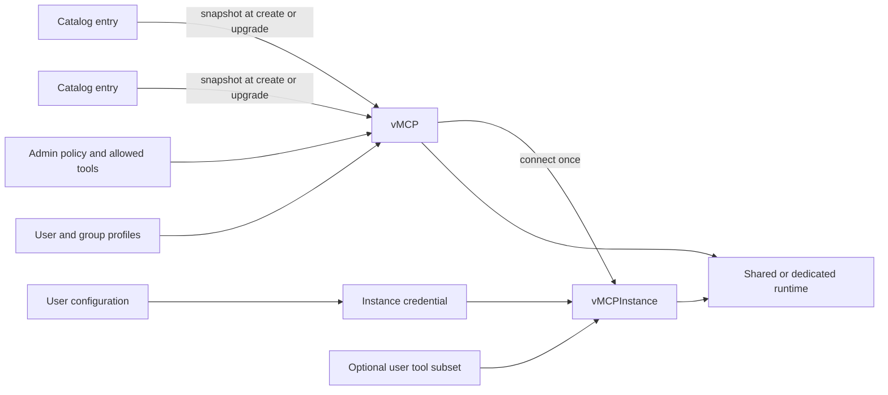

# 2026-09-01: Virtual MCPs

- **Authors:** @thedadams
- **Created:** 2026-09-01

## Summary

Introduce virtual MCPs (vMCPs) as the single way to expose MCP servers through
Obot. A vMCP may contain one or more catalog entries, replacing both standalone
and composite MCP servers with one resource and connection model.

Each vMCP stores a snapshot of every catalog entry it uses, an administrator-
or owner-defined configuration policy, and profiles that grant users and groups
access to sets of tools. Catalog changes are reported as diffs but never change
a vMCP until an explicit upgrade. Each user connects once to a vMCP, producing
one `vMCPInstance` whose credential stores that user's configuration and whose
tool selection may only narrow the union granted by the profiles matching the
user.

Catalog entry YAML is also flattened: environment variables and headers move
into one typed `configuration` section, and `serverUserType` is removed.
Whether a vMCP is multi-user is derived from its user-allowed configuration,
with an administrator override to force single-user operation.

Existing MCP servers remain operational during a deprecation period. The UI
provides an option to convert any existing server to the vMCP model, while a
separate migration tool updates GitOps catalogs to the new catalog-entry schema.

## Related issues

- [obot-platform/obot#7724](https://github.com/obot-platform/obot/issues/7724) —
  drives the vMCP resource, catalog schema, connection, and migration design.

## Related ODPs

- [2026-08-16: Thin composites](../2026-08-16-thin-composites/README.md) —
  superseded by this proposal. vMCPs replace composite MCP servers rather than
  evolving their storage and update behavior.

## Problem and motivation

Obot currently has separate concepts for catalog entries, standalone MCP
servers, composite MCP servers, and multi-user server instances. Which resource
a client connects to depends on how the server was created. Composition,
configuration ownership, tool restrictions, update behavior, and user scope are
therefore spread across several related resource types and API paths.

Catalog entries also represent configuration in multiple places. Environment
variables and remote headers use different sections, and `serverUserType`
requires catalog authors to declare a runtime behavior that can instead be
derived from whether users must provide non-header configuration.

Finally, a live dependency on a catalog entry is not an appropriate runtime
contract. An edit, sync failure, or deletion of a catalog entry must not
silently change or stop an MCP endpoint that users already depend on. Operators
need a stable deployed definition, a visible diff when its source changes, and
an explicit upgrade action.

## Goals

- Make a vMCP the only new resource through which an MCP server is exposed by
  Obot.
- Represent one server and an aggregation of servers with the same resource.
- Give administrators explicit control over fixed, user-allowed, and prohibited
  configuration.
- Derive multi-user behavior instead of declaring it in catalog YAML.
- Preserve a vMCP's behavior when a source catalog entry changes or disappears.
- Require an explicit, diff-driven upgrade to adopt catalog changes.
- Give every user at most one instance and one instance-scoped credential per
  vMCP.
- Grant vMCP access and tools through additive user and group profiles.
- Allow a user to narrow, but never widen, the tools granted by matching
  profiles.
- Restrict organization-consumable vMCP creation to administrators while
  allowing users to create personal vMCPs from catalog entries they can access.
- Reconcile access loss for personal vMCPs without affecting shared vMCPs.
- Support vMCP creation and synchronization through GitOps outside catalogs.
- Provide deliberate migration paths for existing servers and GitOps catalogs.

## Non-goals

- Automatically upgrading vMCPs when catalog entries change.
- Defining new runtime semantics for environment, header, file, dynamic-file,
  or interpolation handling beyond the catalog flattening described here.
- Immediately removing or automatically converting existing MCP servers.
- Allowing a non-administrator, including a Power User Plus user, to create a
  vMCP for consumption by other users.

## Context and constraints

A vMCP can contain one catalog entry or aggregate several. Existing composition
behavior such as tool aggregation, prefixes, and vMCP-level tool restrictions
continues to apply, but it is owned by the vMCP rather than a composite server.

Catalog access and vMCP access are separate capabilities. Catalog access allows
a user to construct a personal vMCP. It does not allow that user to publish a
shared vMCP. Conversely, a user may consume an administrator-created vMCP
when one of its profiles grants them access, without access to the source
catalog entries, because the vMCP owns snapshots of the definitions it serves.

Catalog deletion is not an emergency stop for deployed vMCPs. A deleted entry's
snapshot remains executable. Administrators must disable or delete affected
vMCPs when continued execution is undesirable.

## Proposed design

### Resource and data flow



The principal resources are:

```text
vMCP
├── metadata
├── components[]
│   ├── source catalog and entry identity
│   ├── catalog-entry snapshot
│   ├── source digest
│   ├── configuration policy
│   ├── static OAuth credential reference, when required
│   └── allowed tools, prefixes, and overrides
├── profiles[]
│   ├── users and groups
│   └── allowed tools
├── forceSingleUser
└── status
    ├── source diffs and missing sources
    └── readiness and component errors

vMCPInstance
├── vMCP identity
├── user identity
├── credential identity
└── enabled tools ⊆ vMCP allowed tools
```

The `(vMCP, user)` pair is unique. Connecting is idempotent: the first
connection creates the instance and later connection or configuration actions
update the same instance.

### Flattened catalog configuration

Catalog entry YAML replaces the separate environment-variable and remote-header
definitions with one `configuration` collection. Every item has one of these
types:

- `env`
- `header`
- `file`
- `dynamicFile`
- `interpolated`

The item retains the existing metadata applicable to configuration, such as its
key, display name, required and sensitive flags, prefix, description, and secret
binding. The exact fields used by each established type do not change as part of
this proposal.

Values of all types remain available for interpolation for backward
compatibility. An item explicitly typed `interpolated` is available to
interpolation but is not set in the process environment. This makes it possible
to define an interpolation-only input without breaking catalogs that already
interpolate ordinary environment or other configuration values.

`serverUserType` is removed from catalog entries. Server sharing is a property
of a configured vMCP, not a catalog declaration.

Catalog sync accepts the new schema and stops syncing catalogs that still use
the old or otherwise invalid schema. A migration tool converts existing GitOps
catalogs by flattening their configuration, assigning the corresponding types,
and removing `serverUserType`.

### Static OAuth credentials

When a catalog entry requires static OAuth, its OAuth credentials are stored at
the catalog-entry level. A vMCP component stores a reference to those credentials
and does not copy their secret material into its catalog-entry snapshot.

All vMCPs created from the catalog entry therefore use the same credential, and
rotating it takes effect without upgrading each vMCP snapshot. vMCP responses,
exports, and GitOps definitions contain only the reference, never the OAuth
secret.

### Creating and configuring a vMCP

A vMCP selects one or more catalog entries. For every configuration item in
each selected entry, its creator chooses one policy:

- **Fixed:** the creator supplies the value used by the vMCP.
- **User allowed:** each connecting user may supply a value on their instance.
- **Prohibited:** no user value is accepted.

The default is prohibited. Omitting a policy must therefore never grant a user
the ability to inject configuration. Required configuration that is neither
fixed nor user-allowed prevents the affected component from becoming ready.

A vMCP is automatically multi-user when it has no user-allowed non-header
configuration. User-allowed headers are stored per instance but do not force a
dedicated runtime. An administrator may set `forceSingleUser` even when the
vMCP would otherwise be multi-user. The existing runtime and instance patterns
implement the resulting shared or dedicated execution and are unchanged by
this proposal.

Only administrators may create a vMCP that other users can consume. This check
is enforced by the API and is not satisfied by Power User Plus or any other
non-administrator role.

A user who can access catalog entries may create a personal vMCP from those
entries. A personal vMCP is visible and consumable only by its owner and cannot
later be shared without an administrator-controlled operation.

### Profiles

Profiles are fields on a vMCP, not separate resources. Each profile names one or
more users or groups and the tools that profile grants. A profile can only grant
access; there is no deny rule. A user may connect when at least one profile
matches the user directly, matches one of the user's groups, or names `*`. A
profile may grant only tools exposed by the vMCP.

Every vMCP starts with one profile that grants `*` access to all tools exposed
by the vMCP. Its creator may change that profile and add others. The personal
scope of a user-created vMCP remains authoritative, so profiles cannot make a
personal vMCP consumable by other users.

At connection time, Obot resolves the user's current groups and unions the tool
sets from every matching profile. Because profiles are grant-only, a narrower
profile cannot subtract a tool granted by another matching profile. The user may
then choose a subset of that union for the instance. If profile membership or
group membership changes, Obot recalculates the grant so an existing instance
cannot continue exposing tools or vMCP access the user no longer has.

### Snapshots, drift, and explicit upgrades

Each vMCP component stores the complete catalog-entry definition used to create
it, including runtime definition, configuration schema, metadata, and tool
policy. Static OAuth secret material is the exception described above: the
snapshot stores its catalog-entry-level credential reference. The component also
retains source identity and a digest so Obot can compare that snapshot with the
current catalog entry.

Runtime resolution always uses the stored snapshot. Editing, deleting, or
temporarily failing to sync a source catalog entry does not alter or stop an
existing vMCP. When the source still exists and differs, vMCP status reports a
pending update and the API/UI presents the diff. When it no longer exists,
status reports the missing source but the component remains functional.

An explicit upgrade validates the proposed snapshots and component policy
before replacing the current version. If validation or persistence fails, the
old snapshots remain authoritative and existing instances continue using them.
An upgrade may update all changed components in one operation while reporting
the diff per component. Upgrades to vMCPs consumable by other users require an
administrator.

Instance credentials are reconciled against the old and new configuration
policies as part of an upgrade:

- Values for unchanged user-allowed items are retained.
- A removed item or a change from user-allowed to fixed or prohibited removes
  the instance's authority to supply that value; any stored instance value is
  deleted or ignored before the new snapshot runs.
- An item newly made user-allowed has no instance value until the user supplies
  one. If it is required, the instance reports missing configuration.
- A new or changed fixed value comes only from the upgraded vMCP and cannot be
  shadowed by an older instance credential.

This reconciliation prevents stale credentials from bypassing a tightened
administrator policy and makes relaxed policy visible as configuration the user
may need to provide.

### Access reconciliation for personal vMCPs

Obot re-evaluates the owner's access when relevant access state changes and
during periodic reconciliation. If the owner loses access to an entry that
still exists, that component and its component-scoped instance configuration
and tool selections are removed from the personal vMCP. Other components
continue to operate.

If no components remain, Obot deletes the personal vMCP, its instance, and its
instance-scoped credential. Removal is idempotent so repeated access events do
not recreate or partially delete state.

Deleting or changing a catalog entry is different from revoking a user's access
to an existing entry. Deletion preserves the snapshot as described above;
access denial removes it from a personal vMCP. Administrator-created shared
vMCPs are not pruned based on a consuming user's catalog access.

### Connecting, credentials, and tool scoping

The connect operation creates the user's `vMCPInstance` if it does not exist.
Configuration supplied by the user is validated against the current vMCP
policy and stored as a credential whose scope is exactly that instance. Values
for fixed or prohibited items are rejected rather than silently stored.

The tools available to the instance are the union of all tools granted by the
user's matching profiles. The user may select an enabled subset of that union.
Obot rejects an attempt to add a tool outside it. Reconnecting or reconfiguring
updates the same instance and may further narrow or restore tools only within
the current profile-derived grant.

When a vMCP upgrade removes a tool or component, every affected instance loses
that tool. An instance selection cannot keep a tool that the vMCP no longer
allows.

### GitOps vMCPs

vMCPs may be authored and synchronized through GitOps, but they do not live in
an MCP catalog. A new synchronization path owns these resources independently
from catalog sync. A committed change to a Git-managed vMCP is an explicit
administrator change; ordinary changes to a referenced catalog entry still
follow the snapshot and diff rules.

As with catalogs, removing a Git-managed vMCP from its source does not delete a
vMCP that has existing instances. Obot retains it and reports that it is no
longer present in the source so existing connections continue to work. The file
format follows the vMCP data structure, and synchronization follows the existing
catalog-entry sync model.

### Existing server conversion

Existing standalone and composite MCP servers continue to run through the
compatibility period. Obot adds a **Convert to vMCP** action in the UI for every
existing server.

Conversion maps a standalone server to a one-component vMCP and a composite to
a multi-component vMCP. It copies the configuration from the existing
`MCPServer`, which already contains the snapshot needed by the vMCP, and carries
forward tool overrides, prefixes, and disabled-tool choices. Conversion
validates the complete result before making it available and is idempotent so a
retry cannot create multiple vMCPs from the same server.

The old server remains available during the compatibility window so conversion
does not itself break an existing endpoint. The new vMCP has a different connect
URL, so clients must reconnect using that URL. The old server can be removed
explicitly after its connections have drained.

## Alternatives considered

**Continue separate standalone and composite server models.** This preserves
the current types but also preserves different connection, update, access, and
configuration paths for what is conceptually the same operation.

**Evolve thin composites.** The superseded proposal improves the existing
composite implementation, but it leaves standalone servers and composites as
different public abstractions. vMCPs make aggregation a cardinality choice on a
single resource.

**Resolve catalog entries live.** Live references avoid snapshot storage but
allow catalog edits, deletions, and sync failures to alter running endpoints
without review. This is incompatible with explicit administration and stable
connections.

## Trade-offs

- Snapshots duplicate catalog data and may continue running code or
  configuration that has been removed upstream. In return, deployed behavior is
  stable and upgrades are reviewable.
- Explicit upgrades require operator action and allow vMCPs to lag behind their
  sources. Status, diffs, and operational reporting must make that lag visible.
- The secure default of prohibited may require more setup when creating a vMCP,
  but it prevents omitted policy from becoming unintended user authority.
- Removing a component after personal catalog-access loss may change the tools
  behind an existing connection. This is intentional access enforcement and
  must be visible in status and audit events.
- Retaining Git-managed vMCPs with instances means Git removal is not an
  immediate deletion mechanism. An explicit administrative cleanup remains
  necessary after connections are gone.
- Grant-only profiles are simple to combine, but any broad matching profile
  widens the user's union. Exceptions must be expressed by narrowing grants
  rather than adding a deny profile.

## Risks and open questions

- A deleted catalog entry does not revoke its snapshots. Operational guidance
  must distinguish catalog cleanup from disabling a vulnerable or compromised
  vMCP.
- Static OAuth references are an exception to snapshot self-containment. We
  need to define how their credentials are retained when a catalog entry is
  deleted so existing vMCPs continue to function.
- Obot's own MCP catalog is synchronized into live production installations.
  Before old catalog YAML stops syncing, we need a migration plan for that
  catalog that does not break existing users.

## Rollout and migration

The rollout occurs in stages:

1. In one release, add the flattened catalog schema, vMCP and `vMCPInstance`
   resources, profiles, new sync and connection paths, drift reporting, explicit
   upgrades, and the UI conversion action. At the same time, make vMCP creation
   the only path for new MCP endpoints, stop syncing old or invalid catalog
   YAML, and ship the GitOps catalog conversion tool. Existing MCP servers keep
   running.
2. In the next release, mark existing MCP servers and their UI as deprecated
   while continuing to run them.
3. In a future release, remove legacy server support after operators have had a
   release window to convert, reconnect using the new URLs, and drain old
   connections.

Rollback before legacy removal disables new vMCP creation while leaving stored
vMCP resources intact for a compatible build to resume. Catalog migrations
should be committed separately so operators can revert their Git sources if the
new catalog sync must be rolled back. Conversion does not delete the source
server, preserving a connection-level rollback path during the compatibility
window.

## Testing and validation

**Catalog schema.** Validate every configuration type, reject unknown or
ambiguous types, verify old ordinary values remain interpolatable, and verify an
`interpolated` item is not injected into the environment. Confirm
`serverUserType` is absent from the new schema and the migration tool produces
equivalent flattened catalogs.

**Creation and authorization.** Verify omitted configuration policy becomes
prohibited; only administrators can create shared vMCPs; Power User Plus cannot;
and users can create only personal vMCPs from catalog entries they can access.
Exercise one- and multi-entry vMCPs.

**Runtime derivation.** Cover no user-allowed configuration, user-allowed
headers only, user-allowed non-header configuration, and `forceSingleUser`.

**Snapshots and upgrades.** Change and delete source entries and verify running
vMCP behavior does not change. Verify diffs, missing-source status, failed
upgrade rollback, and successful adoption. Exercise every configuration-policy
transition and confirm newly prohibited instance values cannot reach the
runtime. Verify static OAuth secrets are not copied into vMCPs, credential
rotation reaches every referencing vMCP without an upgrade, and credential
references never expose the secret.

**Access reconciliation.** Revoke access to one of several personal components,
verify only that component and its scoped state are removed, then revoke the
last and verify the vMCP, instance, and credential are deleted. Verify source
deletion preserves a snapshot and shared vMCPs are unaffected by consumer
catalog access.

**Instances and tools.** Race repeated connect requests and verify one instance
and credential. Verify reconfiguration updates that instance, credentials
cannot cross instance boundaries, direct and group profiles grant the union of
their tools, `*` grants access, and a narrower matching profile cannot deny a
grant from another profile. Verify users without a matching profile cannot
connect, user selections can narrow but not widen the union, and profile or
group changes contract or revoke existing instance access. Remove allowed tools
during an upgrade and verify instance scopes contract.

**GitOps and compatibility.** Create and update a Git-managed vMCP, remove one
with and without existing instances, and verify retention behavior. Convert
standalone and composite servers through the UI, retry conversion, verify their
configuration is copied from the existing `MCPServer`, and verify old
connections continue until clients reconnect to the new URL and the old server
is explicitly drained and removed.

## References

None.
