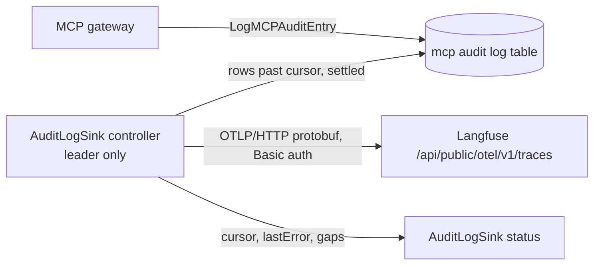

# 2026-10-08: Langfuse audit log sink

- **Authors:** @strelok89
- **Created:** 2026-10-08

## Summary

Add an optional audit log sink that continuously ships MCP tool calls from Obot's persisted
audit logs to Langfuse, using Langfuse's OTLP traces endpoint. A leader-run controller reads
new rows past a stored cursor, maps them to OTLP spans with Langfuse and OpenTelemetry GenAI
attributes, and advances the cursor only after Langfuse accepts the batch. The sink is off by
default, never runs in the gateway request path, and sends request/response bodies only when
an Auditor enables it.

## Related issues

- [obot-platform/obot#8183: Stream MCP audit logs to Langfuse](https://github.com/obot-platform/obot/issues/8183)

## Related ODPs

None.

## Problem and motivation

Obot's MCP audit logs hold what an LLM observability tool needs: who called which tool,
with what arguments, what came back, and how long it took. Today the data leaves Obot only as
JSONL files in object storage
([audit log export](https://docs.obot.ai/configuration/audit-log-export/)), so every team
that wants it in Langfuse writes and operates its own reshaping job. That job has to:

- read bodies through `/api/mcp-audit-logs/detail/{id}` one row at a time, because list
  responses always omit them (`pkg/api/handlers/mcpgateway/auditlog.go`, `ListAuditLogs`);
- hold an Auditor API key, since only Auditors may read bodies;
- handle the request/response merge, retries, deduplication and its own cursor, because
  scheduled exports cover time windows and track no position.

Obot's OpenTelemetry export (`pkg/otel/otel.go`) does not fill the gap: the only spans are
`otelhttp` server spans named by route pattern, with no tool, user, session or payload.

## Goals

- MCP `tools/call` records appear in Langfuse within about a minute of being persisted,
  without any external job.
- Records are attributed to the user by email and grouped into Langfuse sessions.
- A Langfuse outage or misconfiguration never affects MCP traffic.
- Each record is sent once: no record is skipped silently and none is re-sent in normal
  operation, because Langfuse v4 does not deduplicate repeated span IDs. Any gap is reported
  on the sink's status.
- Shipping request/response bodies requires the same privilege as exporting them today.

## Non-goals

- **LLM gateway audit logs.** They map naturally to Langfuse `generation` observations (model,
  token usage, prompt and completion) and reuse this controller; deferred to a follow-up to
  keep the first change small.
- **Local-agent (device) tool-call logs.** Same table, but they carry hostnames, working
  directories and git metadata; a follow-up with its own privacy review.
- Linking an MCP tool call to the LLM request that caused it. Obot has no shared trace
  context between the two today.
- Sinks other than Langfuse. The design keeps a small interface so a generic OTLP sink can
  follow.
- Backfilling records older than the retention window, or reading data back from Langfuse.

## Context and constraints

- **Write path.** `LogMCPAuditEntry` (`pkg/gateway/client/auditlogpersister.go`) runs on every
  replica, encrypts bodies and buffers entries; the persistence loop flushes every
  `OBOT_SERVER_MCPAUDIT_LOG_PERSIST_INTERVAL_SECONDS` (default 5). A failed batch is re-queued.
  `insertMCPAuditLogs` (`pkg/gateway/client/mcpauditlog.go`) merges a response-only entry into
  its pending request row, so a row is not final when first inserted.
- **Export subsystem.** `AuditLogExport` and `ScheduledAuditLogExport` are storage types;
  credentials live in the gateway credential store; `StorageProvider` is object-store only
  (`Test`, `Upload`), so it is not a fit for an HTTP API.
- **Leader election.** Controllers run on the elected `obot-controller` leader, with the lock
  in Postgres (`adr/2026-09-02-sql-leader-lock.md`).
- **Body access.** Only Auditors can read or export bodies
  (`auditlog.go`, `canAccessFullPayload = req.UserIsAuditor()`).
- **User identity.** Audit rows store the Obot user ID; email is resolved through the gateway
  user store (`UserByIDIncludeDeleted` in `pkg/gateway/client/user.go`, so rows from deleted
  users still resolve).
- **Langfuse ingestion.** The legacy `POST /api/public/ingestion` API is deprecated and stops
  accepting trace and observation events on Langfuse Cloud on 2026-11-16; the replacement is
  `POST /api/public/otel/v1/traces` (OTLP over HTTP, JSON or protobuf, gzip supported, no
  gRPC). Langfuse stores traces only. Self-hosted deployments need Langfuse v3.22.0 or later
  for the OTLP endpoint.
- **Langfuse v4 span rules** ([custom ingestion migration
  guide](https://langfuse.com/integrations/native/opentelemetry/migration-to-v4)): send the
  `x-langfuse-ingestion-version: 4` header; export each operation as one complete span; do not
  re-export a span ID that Langfuse already accepted ("Langfuse v4 does not reliably
  deduplicate repeated records ... Re-ingesting the same ID can create duplicate
  observations"); put input and output on the root observation; copy user, session and
  filterable metadata to every span.

## Proposed design

### Components



1. **`AuditLogSink` storage type** (next to `AuditLogExport`):

   ```yaml
   spec:
     displayName: Langfuse
     type: langfuse                  # only value in this proposal
     enabled: true
     callTypes: [tools/call]         # default
     filters: {...}                  # same shape as export Filters
     withRequestAndResponse: false   # Auditor-only to set true
     maxBodyBytes: 262144            # truncate larger bodies, mark as truncated
   status:
     cursor: {id: 12345}             # last delivered audit log row ID
     lastSentAt: ...
     lastError: ""
     gaps: []                        # windows lost to retention while the sink was failing
   ```

   An installation may define several sinks (for example one per Langfuse project), each with
   its own cursor. The status keeps a per-source cursor map so LLM logs can be added later
   without a schema change.

2. **Credentials** in the gateway credential store under a per-sink context (as
   `audit-log-export-storage-credentials` does): Langfuse base URL, public key, secret key.
   Write-only through the API, with a `Test` endpoint that sends one empty OTLP request.

3. **Controller** on the leader. Every poll interval (default 15s):
   - Select rows with `id > cursor`, ordered by `id`, up to a batch size. The cursor is the
     auto-increment row ID rather than `created_at`, because a persistence batch that is
     retried can commit rows whose `created_at` is older than rows already delivered; their
     IDs are still higher than the cursor.
   - Stop at the first row that is not settled: younger than `settle` (default 60s, must
     exceed the persist interval) and still without its response. This gives response entries
     time to merge into their request rows. A row still without a response after `settle` is
     sent as incomplete.
   - Read only up to the visibility horizon, so that a row whose inserting transaction is
     still open, and which will appear with a lower ID than rows already visible, is not
     skipped (see open question 1).
   - Resolve user emails for the batch (cached), decrypt bodies only when
     `withRequestAndResponse` is true, map to spans, send, and on a 2xx write the new cursor to
     status. On failure, keep the cursor and back off (retry client modelled on
     `pkg/producttelemetry/client.go`).
   - Never re-read behind the cursor. Langfuse v4 does not deduplicate repeated span IDs, so
     each row is sent once. The one exception is an ambiguous failure (a timeout after
     Langfuse may have accepted the batch): the batch is retried, which can duplicate those
     spans. Batches are kept small to bound this, and it is documented as a known limitation.
   - If the oldest unsent row has passed retention, record the lost window in `status.gaps`
     and continue from the oldest remaining row.

4. **Sink interface**, so the Langfuse code is one implementation:

   ```go
   type Sink interface {
       Test(ctx context.Context) error
       Send(ctx context.Context, records []Record) error
   }
   ```

### Mapping to OTLP spans

All spans carry the resource attribute `service.name=obot` and the header
`x-langfuse-ingestion-version: 4`.

Each tool call is its own trace with one root span. Calls are grouped through the Langfuse
session (the MCP session), following Langfuse's guidance to group related traces with session
IDs. A single-span trace also satisfies the v4 rules that the root observation carries the
input and output, and that user, session and metadata are on every span.

| Langfuse field | OTel attribute | From the MCP audit row |
|---|---|---|
| Trace ID (16 bytes) | span context | `sha256("obot-mcp" + id)[:16]` |
| Span ID (8 bytes) | span context, no parent | `sha256("obot-mcp-span" + id)[:8]` |
| Trace and observation name | `langfuse.trace.name`, span name | `callIdentifier` (tool name) |
| Type | `langfuse.observation.type` | `tool` |
| Session | `langfuse.session.id` | `sessionID` |
| User | `langfuse.user.id` | user's newest email, resolved at send time; Obot user ID if the user has no email |
| Input / output | `langfuse.observation.input` / `langfuse.observation.output` (JSON strings) | tool arguments / tool result, only with `withRequestAndResponse` |
| Level / status message | span status, `langfuse.observation.level` | `ERROR` with `error` when the call failed |
| Filterable metadata | `langfuse.observation.metadata.<key>` | `obot_user_id`, `mcp_server`, `catalog_entry`, `client_name`, `client_version`, `api_key_name`, `response_status` |
| Timing | `startTimeUnixNano` / `endTimeUnixNano` (both always set) | `createdAt` to `createdAt + processingTimeMs` |

Deriving IDs from the row ID makes them fixed-width as OTLP requires and traceable back to
the audit log. Spans are built as read-only span snapshots with these IDs and passed to the
`otlptracehttp` exporter directly; the tracer's random ID generator and batch processor are
not used. Metadata uses the `langfuse.observation.metadata.` prefix because unprefixed
attributes land under `metadata.attributes` and are not filterable in Langfuse.

### Security and privacy

- Creating or updating a sink with `withRequestAndResponse: true` requires the Auditor role,
  the same rule as exporting bodies. Admins may manage metadata-only sinks.
- Every span carries the user's email. This is personal data leaving Obot for an external
  system, so the sink's admin UI states it, and the docs say so alongside the body warning.
- Decrypted bodies exist only in memory for the duration of a send.
- HTTPS is required unless the operator explicitly allows plain HTTP (for in-cluster
  Langfuse).

## Alternatives considered

### Status quo: object-store export plus an external job

Works today, but each operator rebuilds the same reshaping, cursor and dedup logic, and the
job needs an Auditor key. Scheduled exports are window-based with no cursor.

### Push from `LogMCPAuditEntry`

Lowest latency, but it sees entries before the request/response merge, runs on every
replica, and loses buffered entries on restart. It also puts sink back-pressure next to the
gateway path.

### MCP filters (webhooks)

Filters see requests and responses in real time, but they fail closed (a filter error returns
an error to the client, `proxy_hooks.go`) and receive only the JSON-RPC message, with no user
or session.

### Obot's existing OpenTelemetry export

No code needed, but the spans are HTTP server spans without tool, user or payloads. Adding
content to them would mean new instrumentation in the gateway path and would bypass the
Auditor rule.

### Langfuse legacy ingestion API

Richer native event types, but deprecated with a Cloud sunset on 2026-11-16.

### A Langfuse SDK

Langfuse ships official SDKs for Python and JS/TS only. The community Go SDKs
(`henomis/langfuse-go`, `fugue-labs/langfuse-go`) wrap the deprecated ingestion API. Langfuse's
guidance for custom instrumentation is to send OTLP to `/api/public/otel/v1/traces`. The sink
uses the OpenTelemetry Go SDK's `otlptracehttp` exporter, already in Obot's dependency tree via
`autoexport`, and calls `ExportSpans` synchronously rather than through a
`BatchSpanProcessor`, so the cursor advances only after Langfuse confirms the batch.

### Generic OTLP sink instead of Langfuse

Viable and vendor-neutral, and most of this design carries over. Langfuse is proposed first
because its attribute mapping (observation types, sessions, users) is well defined. A
`type: otlp` sink can reuse the controller and mapping without the `langfuse.*` attributes.

## Trade-offs

- Latency is bounded below by `settle` plus the poll interval (about a minute by default), in
  exchange for complete, merged rows and a single writer.
- A new cursor store (the sink's status) is added; exports have none today.
- Polling adds one indexed range query per sink per interval on the leader.
- Email attribution makes Langfuse readable without a lookup, at the cost of sending personal
  data on every span.

## Risks and open questions

1. **Visibility horizon.** Concurrent inserts from several replicas can make a lower row ID
   visible after a higher one. Because the cursor never moves backwards, the controller must
   only read IDs below a horizon that no open transaction can still fill (for example from
   Postgres snapshot visibility, or by holding back IDs newer than a short delay). The exact
   mechanism is to be settled with maintainers during implementation.
2. **Duplicates on ambiguous failures.** Langfuse v4 does not deduplicate a re-sent span ID,
   so retrying a batch after a timeout can duplicate spans. Proposed: small batches and a
   documented limitation. An alternative is not retrying ambiguous failures and recording them
   as gaps instead; reviewers' preference wanted.
3. **Payload size.** Langfuse's API reference documents no maximum OTLP request or attribute
   size. `maxBodyBytes` truncation plus gzip are the proposed guards; limits to be measured
   against a test deployment.
4. **Email changes.** Decided: spans always carry the user's newest email, looked up at send
   time, never the email recorded when the call was made. The email cache has a short TTL
   (default 5 minutes) so a change takes effect quickly. Spans already sent are not rewritten,
   so calls sent before a change stay under the old email in Langfuse; the Obot user ID in
   metadata links both.

## Rollout and migration

- New storage type and controller; no change to existing tables or exports.
- Off by default. A new sink's cursor starts at its creation time; an optional `startTime`
  within retention allows a bounded backfill.
- Disable by setting `enabled: false` (cursor kept) or delete the sink.

## Testing and validation

- Unit tests for row-to-span mapping, deterministic IDs, email resolution and fallback, body
  gating and truncation.
- Controller tests with a fake OTLP receiver: cursor advance on 2xx, no advance on failure,
  backoff, rows held back at the visibility horizon and unsettled rows, gap recording when
  rows age out.
- Integration test against Langfuse in Docker, following Langfuse's canary checklist: tool
  observations appear without ingestion delay, with the expected name, timing, session, user,
  filterable metadata and (when enabled) input/output, and a controller restart neither skips
  nor re-sends rows.
- Authorization tests: an Admin without Auditor cannot enable bodies.

## References

- [Audit log export](https://docs.obot.ai/configuration/audit-log-export/)
- [Langfuse OpenTelemetry integration](https://langfuse.com/integrations/native/opentelemetry)
- [Migrate custom ingestion to Langfuse v4](https://langfuse.com/integrations/native/opentelemetry/migration-to-v4)
- [Langfuse tracing best practices](https://langfuse.com/docs/observability/best-practices)
- `adr/2026-09-02-sql-leader-lock.md`
- `pkg/gateway/client/auditlogpersister.go`, `pkg/gateway/client/mcpauditlog.go`,
  `pkg/gateway/client/user.go`, `pkg/controller/handlers/auditlogexport/`
