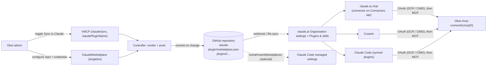

# 2026-10-10: Sync vMCPs to Claude through a GitHub-hosted plugin marketplace

- **Authors:** @cjellick
- **Created:** 2026-10-10

## Summary

Let an administrator mark shared vMCPs as **Sync to Claude**. Obot renders the
marked vMCPs as a Claude plugin marketplace, one plugin per vMCP, and pushes
that marketplace to a GitHub repository the administrator owns. The claude.ai
organization Owner adds the repository once under **Organization settings >
Plugins & skills > Sync from GitHub** with automatic sync turned on. From then
on, every change made in Obot is a commit that claude.ai picks up, and members
get the vMCPs in claude.ai chat, Cowork, and Claude Code without any per-user
or per-server setup. Authentication to the vMCP endpoints uses the MCP OAuth
support Obot already has.

## Related issues

- [obot-platform/obot#8211](https://github.com/obot-platform/obot/issues/8211)
  — the feature request this proposal designs.

## Related ODPs

- [2026-09-01: Virtual MCPs](../2026-09-01-virtual-mcps/README.md) — depends on.
  vMCPs are the only resource this proposal exposes to Claude, and their
  connect URL, OAuth behavior, and visibility model are taken as given.

## Problem and motivation

An Obot administrator who wants users to reach vMCPs from Claude has to do it
by hand today, on each surface:

- **claude.ai chat**: an Owner adds a custom connector per vMCP in
  Organization settings > Connectors.
- **Claude Code**: each developer runs `claude mcp add --transport http …` per
  vMCP, or an Owner pastes a `managedMcpServers` block into managed settings
  and edits it whenever a vMCP changes.

Nothing in Obot records which vMCPs are meant to be visible in Claude, and
nothing keeps Claude current when a vMCP is added, renamed, or removed. The
"Connect all vMCPs" dialog in the UI generates snippets, but they are a
snapshot that the admin has to re-copy.

Anthropic now provides a single distribution mechanism that covers all three
surfaces: a **plugin marketplace** synced from a Git repository through the
organization's plugin settings. A plugin may bundle a remote MCP server by URL,
and a plugin installed for an organization reaches chat, Cowork, and Claude
Code. This proposal makes Obot produce that marketplace.

## Goals

- An administrator chooses which shared vMCPs are exposed to Claude with one
  toggle per vMCP.
- After a one-time setup in Obot (repository, credential) and a one-time setup
  in claude.ai (add the marketplace, turn on automatic sync, choose default
  access), no further administrator action is needed when vMCPs change.
- The repository content is deterministic from Obot state, so a sync is a
  no-op when nothing changed and exactly one commit when something did.
- Users authenticate to vMCPs through Obot's existing MCP OAuth flow; no
  secrets are written to the repository.
- The administrator can see sync status, the last commit, and any error in
  Obot, and can trigger a sync on demand.
- The same repository works for Claude Code managed settings
  (`extraKnownMarketplaces` + `enabledPlugins`) for developers whose terminal
  sessions do not sync from a claude.ai account.

## Non-goals

- Serving the marketplace directly from Obot. claude.ai organization sync only
  reads repositories through the Claude GitHub App, a GitHub Enterprise Server
  App, or a GitLab access token; there is no generic Git or HTTPS source. See
  [Alternatives considered](#alternatives-considered).
- Adding connectors to claude.ai **Organization settings > Connectors** on the
  Owner's behalf. Anthropic exposes no API for that; the plugin's
  **Connectors** tab lists the vMCP, and the Owner adds it from there once.
- Mapping Obot vMCP profiles or groups to claude.ai user groups. In the first
  version every synced vMCP has the same availability, chosen by the Owner in
  claude.ai. Obot's own access control still applies when a user connects.
- Syncing personal vMCPs, catalog entries, legacy MCP servers, or skills.
- More than one marketplace per Obot installation.
- GitLab and GitHub Enterprise Server hosting. The design does not preclude
  them (Obot pushes over HTTPS with a token either way), but the first version
  documents and tests github.com only.

## Context and constraints

### What Claude can ingest

The facts below come from Anthropic's current documentation and determine the
shape of the design.

| Surface | Mechanism | Constraint |
| --- | --- | --- |
| claude.ai organization plugin sync | Owner adds a marketplace repository under Organization settings > Plugins & skills (**Sync from GitHub** / **Sync from GitLab**) and sets each plugin's availability: Not available, Available to install, Installed by default, Required. | Repository is read through the organization's GitHub App or GitLab token, not by `git clone`. On github.com the repository must be private or internal. Plugin sources must be relative paths inside the repository or `github`/`url`/`git-subdir` repositories; other hosts are rejected. Sync runs on **Re-sync** or, with **Sync automatically**, on each push to the default branch. |
| Plugin contents | A plugin folder with `.claude-plugin/plugin.json` and `.mcp.json`. `.mcp.json` lists remote servers as `{"type": "http", "url": "…"}`. | A remote `http` server in a plugin appears on the plugin's **Connectors** tab in chat and Cowork and is loaded directly by Claude Code. A top-level `bin/` directory makes claude.ai reject the plugin. |
| Claude Code | Plugins installed on a member's claude.ai account arrive in Claude Code as synced plugins (v2.1.273+). Independently, managed settings can register a marketplace (`extraKnownMarketplaces`) and force-enable plugins (`enabledPlugins`). | Managed settings sources clone the repository with the machine's own Git credentials, so a private repository needs per-machine access; the synced-plugin path needs none. |
| Authentication | Claude Code and claude.ai perform OAuth against a remote MCP server using dynamic client registration or client ID metadata documents. | Obot already serves protected-resource and authorization-server metadata, dynamic registration, and CIMD, and treats Claude Code's metadata document as a native client (`pkg/api/handlers/mcpgateway/oauth`). |

### Relevant Obot behavior

- A shared vMCP is reachable at `{OBOT_SERVER_HOSTNAME}/mcp-connect/{vmcpID}`
  (`system.MCPConnectURL`). A first connection creates the user's
  `VMCPInstance` automatically, so one URL serves every user.
- `VMCPSpec` is rebuilt by catalog sync for Git-managed vMCPs
  (`pkg/controller/handlers/mcpcatalog/vmcp.go`); only a fixed set of fields
  is carried over. `PUT /api/vmcps/{id}` is rejected for catalog-synced vMCPs.
- Admin-managed `GitCredential`s already exist for HTTPS Git hosts and are
  resolved with `gitcredential.Resolve`. `pkg/git` clones with go-git and
  token auth (`x-access-token`). Nothing in Obot pushes to Git today.
- Controllers run on `nah`; a handler that lists another type is re-triggered
  when objects of that type change.
- Singleton configuration objects exist (`AppPreferences`,
  `AppNotification`) with `GET`/`PUT` handlers keyed on a fixed name.

## Proposed design

### Overview



### Repository layout

Obot owns exactly two paths in the repository and leaves everything else
untouched, so an administrator can keep a README, a license, or hand-written
plugins beside the generated ones.

```text
.claude-plugin/marketplace.json
plugins/
  <plugin-name>/
    .claude-plugin/plugin.json
    .mcp.json
    README.md
```

`marketplace.json`:

```json
{
  "name": "obot",
  "owner": { "name": "Acme Platform Team", "url": "https://obot.acme.example" },
  "description": "MCP servers published from Obot",
  "forceRemoveDeletedPlugins": true,
  "plugins": [
    {
      "name": "github-tools",
      "displayName": "GitHub Tools",
      "description": "Issues, pull requests, and code search",
      "version": "3f2a9c1d",
      "category": "mcp",
      "source": "./plugins/github-tools"
    }
  ]
}
```

`plugins/github-tools/.claude-plugin/plugin.json`:

```json
{
  "name": "github-tools",
  "displayName": "GitHub Tools",
  "description": "Issues, pull requests, and code search",
  "version": "3f2a9c1d",
  "author": { "name": "Acme Platform Team", "url": "https://obot.acme.example" },
  "metadata": { "obotVMCPID": "vmcp1k3j9x" }
}
```

`plugins/github-tools/.mcp.json`:

```json
{
  "mcpServers": {
    "github-tools": {
      "type": "http",
      "url": "https://obot.acme.example/mcp-connect/vmcp1k3j9x"
    }
  }
}
```

`README.md` holds the vMCP description and the connect URL so the plugin
reads sensibly in claude.ai's inventory and in the repository.

Rules:

- `forceRemoveDeletedPlugins: true` so a vMCP that is un-synced or deleted is
  uninstalled on Claude Code machines rather than left behind.
- Plugin sources are relative paths, which both organization sync and
  managed-settings sources accept.
- `version` is the first eight hex characters of a SHA-256 over the plugin's
  rendered files. It changes exactly when the plugin's content changes, which
  is what both claude.ai and Claude Code use to decide an update is available.
- No `bin/`, no scripts, no secrets. The only values in the repository are
  names, descriptions, the Obot server URL, and vMCP IDs.
- JSON is rendered with sorted keys and a trailing newline so the output is
  byte-stable across syncs.

### Data model

`VMCPSpec` gains two fields:

```go
// ClaudeSync marks a shared vMCP for inclusion in the Claude plugin marketplace.
ClaudeSync bool `json:"claudeSync,omitempty"`
// ClaudePluginName is the plugin's stable identity in the marketplace. It is
// assigned when ClaudeSync is first enabled and is never changed automatically,
// because Claude installs reference plugins by name.
ClaudePluginName string `json:"claudePluginName,omitempty"`
```

`ClaudePluginName` is derived from the display name (lower-case kebab-case,
`[a-z0-9.-]`), prefixed with `obot-` when the slug would start with a name
Claude Code reserves (`claude-`, `anthropic-`, `cc-plugin-`), and suffixed
with `-2`, `-3`, … on collision with another vMCP's plugin name. Catalog sync
carries both fields over when it rebuilds a Git-managed vMCP, alongside the
fields it already preserves.

A new singleton storage type:

```go
type ClaudeMarketplaceSpec struct {
    RepoURL         string // HTTPS Git URL, validated by git.NormalizeRepositoryURL
    Branch          string // default "main"; must be the repository's default branch for claude.ai
    GitCredentialID string // admin-managed GitCredential with contents:write on the repository
    MarketplaceName string // marketplace.json "name"; default "obot"
    OwnerName       string // marketplace.json "owner.name"; default from branding/app name
}

type ClaudeMarketplaceStatus struct {
    LastSyncTime  metav1.Time
    IsSyncing     bool
    SyncError     string
    LastCommitSHA string
    ContentHash   string // hash of the last successfully pushed rendering
    PluginCount   int
}
```

It is named `claude-marketplace` in the default namespace and created at
startup like `AppPreferences`, so `GET` always succeeds and status is visible
before configuration. An annotation
(`obot.ai/claude-marketplace-sync: "true"`) requests an immediate sync, in
the same style as `SkillRepository`.

`GitCredentialReferences` gains a `ClaudeMarketplaces` group so a credential
in use by the marketplace cannot be deleted, matching the existing guard for
skill repositories and catalogs.

### Rendering

A new package, `pkg/claudeplugin`, is pure: given the server URL, the
`ClaudeMarketplaceSpec`, and the list of vMCPs with `ClaudeSync` set, it
returns the map of repository paths to file contents plus a content hash of
the whole rendering. It has no I/O, which makes it the unit under test and
lets the API reuse it to show the administrator what will be pushed.

The server URL is `services.ServerURL` (`OBOT_SERVER_HOSTNAME`). Only ready,
shared vMCPs with at least one component are rendered; a vMCP that is marked
but not ready is omitted until it is, and the omission is reported in status.

### Sync controller

A `nah` handler on `ClaudeMarketplace`:

1. Lists `VMCP`s through the request client, so any vMCP change re-triggers
   the handler.
2. Renders the desired files and computes the content hash. If the hash equals
   `Status.ContentHash` and no sync annotation is set, it returns without
   touching the network.
3. Resolves the Git token with `gitcredential.Resolve`.
4. Clones the configured branch with go-git into a temporary directory. A
   shallow clone cannot be pushed from reliably, and the repository is tiny by
   construction, so the clone is full. An empty repository
   (`transport.ErrEmptyRemoteRepository`) is initialized locally and the
   branch is created.
5. Deletes `.claude-plugin/marketplace.json` and `plugins/` from the worktree,
   writes the rendered files, and stages the result. If the worktree is clean,
   it records the hash and stops; otherwise it commits as
   `Obot <noreply@obot.ai>` with the message
   `Sync Claude plugin marketplace (<n> plugins)` and pushes
   `refs/heads/<branch>`.
6. Records `LastSyncTime`, `LastCommitSHA`, `ContentHash`, `PluginCount`, or
   `SyncError`, and clears the sync annotation.

Failure behavior:

| Failure | Behavior |
| --- | --- |
| Missing or invalid credential, repository not found, 403 | `SyncError` set, retry after one hour, surfaced in the UI. |
| Push rejected as non-fast-forward (someone pushed between clone and push) | Retry immediately once by re-cloning; the rendering is regenerated from Obot state, so there is nothing to merge. |
| Push rejected by branch protection | `SyncError` with the server message; the documentation tells administrators the branch must accept direct pushes from the credential. |
| Obot server URL changes | Every `.mcp.json` changes; one commit updates them all. |
| vMCP deleted or un-synced | Its plugin directory and marketplace entry are removed in the next commit; `forceRemoveDeletedPlugins` uninstalls it from Claude Code machines. |
| Obot restarts mid-sync | `IsSyncing` is cleared on the next reconcile; the temporary clone is discarded; the next run re-renders and pushes if needed. |

Concurrency: the controller runs the handler for one object, and the
singleton means at most one sync at a time per installation. Multi-replica
installations already serialize controllers through the leader lock.

### API

| Route | Purpose |
| --- | --- |
| `GET /api/claude-marketplace` | Configuration and status. |
| `PUT /api/claude-marketplace` | Update configuration; validates the URL and credential host. |
| `POST /api/claude-marketplace/sync` | Set the sync annotation. |
| `GET /api/claude-marketplace/setup` | Rendered setup material: the repository URL, the step list for claude.ai, the Claude Code managed-settings snippet, and the list of synced plugins with their connect URLs. |
| `PUT /api/vmcps/{vmcp_id}/claude-sync` | Body `{"enabled": bool}`. Rejected for personal vMCPs. Assigns `ClaudePluginName` on first enable. Works for catalog-synced vMCPs, which reject the general `PUT`. |

All routes are admin-only through the existing `adminAndOwnerRules`.
`types.VMCP` exposes `claudeSync` and `claudePluginName`.

The managed-settings snippet returned by `/setup` is:

```json
{
  "extraKnownMarketplaces": {
    "obot": {
      "source": { "source": "github", "repo": "acme/claude-plugins" },
      "autoUpdate": true
    }
  },
  "enabledPlugins": {
    "github-tools@obot": true
  }
}
```

For a non-github.com URL the source is `{"source": "git", "url": "…"}`.

### UI

- **vMCP actions menu**: a **Sync to Claude** / **Remove from Claude** item for
  administrators on shared vMCPs, and a small indicator on the card and in the
  table for synced vMCPs.
- **Admin > Platform > Claude** view: repository URL, branch, Git credential
  picker (reusing the existing credential list), marketplace name, owner name;
  sync status with last commit link and error; **Sync now**; the list of synced
  vMCPs; and copy-ready setup instructions:
  1. claude.ai: Organization settings > Plugins & skills > Add > Sync from
     GitHub > choose the repository > leave Sync automatically on > choose
     Default access (**Installed by default** is the recommended value).
  2. claude.ai: for chat, Organization settings > Connectors > add each
     plugin's connector once (link to each vMCP's connect URL).
  3. Claude Code, optional: paste the managed-settings snippet into Admin
     Settings > Claude Code > Managed settings.

### Security

- The repository receives no secrets. Static configuration, headers, and
  OAuth client material stay in Obot's credential store as today.
- The Git credential needs write access to one repository. Administrators
  are told to scope a fine-grained token to that repository with contents
  read/write.
- Only administrators can mark vMCPs or change the configuration. A synced
  vMCP is still gated by its Obot profiles at connect time; appearing in
  Claude does not grant access.
- claude.ai requires the marketplace repository on github.com to be private
  or internal, which also keeps vMCP names and descriptions off the public
  internet.

## Alternatives considered

### Obot serves the marketplace itself

Claude Code accepts a bare HTTPS URL to `marketplace.json`, and Obot could
serve one along with a zip archive per plugin (`archive` sources, since
relative paths do not resolve for URL marketplaces). This reaches Claude Code
only. claude.ai organization sync accepts GitHub, GitHub Enterprise Server,
and GitLab repositories, read through the organization's GitHub App or GitLab
token, and rejects other hosts. Since the user's requirement is organization
sync, this cannot be the primary path. It remains a possible addition for
installations that use Claude Code without a Team or Enterprise plan.

### Obot acts as the Git host

Rejected. Organization sync does not `git clone`; it uses the GitHub App API
(repository contents, installation tokens, repository webhooks) or the GitLab
REST API with an access token. Obot could only participate by impersonating a
self-managed GitLab instance's API, which is undocumented, unsupported by
Anthropic, and could break on any claude.ai change. Pushing to a real
repository costs the administrator one repository and one token and uses only
documented behavior.

### Paste-able snippets only (status quo plus)

Generate `managedMcpServers` / `managed-mcp.json` and custom-connector
instructions and leave the administrator to paste them. This is already
partially what the "Connect all vMCPs" dialog does. It never reaches claude.ai
chat or Cowork automatically, and every vMCP change needs a re-paste. The
proposed design still exposes the Claude Code snippet for developers whose
sessions do not sync from a claude.ai account.

### One plugin containing all vMCPs

A single plugin whose `.mcp.json` lists every synced vMCP would be simpler to
render. It would also force an all-or-nothing install, lose per-vMCP
availability in claude.ai, and make the plugin's version change whenever any
vMCP changes. One plugin per vMCP keeps the claude.ai inventory and the
Claude Code `enabledPlugins` map one-to-one with vMCPs.

## Trade-offs

- **An external repository is a new dependency.** Obot's state remains the
  source of truth, the repository is regenerated from it, and the cost is one
  private repository plus a token. In exchange the integration uses only
  documented Claude behavior and gets webhook-driven sync for free.
- **Plugin names are frozen at first enable.** Renaming a vMCP changes its
  display name in Claude but not its plugin name. Changing the plugin name
  would break `enabledPlugins` entries and installed copies; a future version
  can expose the name for explicit editing with a `renames` map.
- **No per-group availability.** Every synced vMCP gets the same claude.ai
  availability. Obot's own authorization still decides who can connect, so
  a user who cannot use a vMCP sees a plugin whose connector fails to
  authorize. Mapping Obot profiles to claude.ai groups is left for later.
- **Chat still needs one Owner action per connector.** Anthropic requires an
  Owner to add a plugin's bundled connector to the organization before members
  can connect it in chat. Cowork and Claude Code do not need this. The setup
  view lists exactly what to add.

## Risks and open questions

- **Anthropic's plugin and sync behavior is moving quickly.** The design
  relies on `.mcp.json` remote servers, relative plugin sources, and
  `forceRemoveDeletedPlugins`, all documented today. Rendering is isolated in
  one package so format changes are local. Owner: implementation PR.
- **Should Obot also bundle a skill per vMCP?** A `SKILL.md` describing the
  vMCP's tools would help Claude choose when to use them, and the rendering
  package can add it later without changing the sync model. Out of scope for
  the first version; worth validating with users.
- **Branch requirement.** claude.ai syncs the repository's default branch.
  The first version documents that `Branch` must be the default branch
  rather than detecting it. TBD whether to look it up through the GitHub API
  when the host is github.com.
- **Is a content-hash `version` acceptable to claude.ai's inventory UI?**
  Claude Code does not check semver; the claude.ai docs ask authors to "raise
  it on every release" but document no format. To be verified during
  implementation against a Team organization; the fallback is a monotonically
  increasing counter stored in status.
- **GitLab.** Pushing works identically; claude.ai supports GitLab sync with
  a GitLab configuration. Documented support can follow once tested.

## Rollout and migration

Additive. The singleton is created empty at startup and does nothing until a
repository is configured; vMCPs default to `claudeSync: false`. No data
migration. Rollback is clearing the configuration (the repository keeps its
last content, and the claude.ai Owner removes the marketplace if desired) and
the two vMCP fields are ignored when unset. Observability is the status
block, the admin view, and controller logs for each push.

## Testing and validation

- **Unit**: golden-file tests for `pkg/claudeplugin` rendering, plugin-name
  slugging and collision handling, and hash stability (same input, same
  bytes).
- **Format**: a test that runs `claude plugin validate` against a rendered
  marketplace when the `claude` CLI is on `PATH`, skipped otherwise, so the
  output is checked against Anthropic's own validator.
- **Controller**: tests with a local bare repository as the remote covering
  first push into an empty repository, no-op when unchanged, one commit per
  change, removal of un-synced plugins, preservation of files outside the
  owned paths, and non-fast-forward retry.
- **API**: handler tests for the toggle (personal vMCP rejected, name
  assignment, catalog-synced vMCP accepted) and configuration validation.
- **End to end**: manual validation against a Claude Team organization —
  marketplace sync, plugin appears in a member's claude.ai, connector
  authorizes through Obot OAuth in chat and in Claude Code, and a vMCP removal
  propagates.

## References

- [Manage plugins for your organization](https://claude.com/docs/plugins/admin)
- [Sync your organization's plugins from a repository](https://claude.com/docs/plugins/org-sync)
- [Roll out a plugin to your whole organization](https://claude.com/docs/plugins/org-rollout)
- [Plugin structure and testing — bundle an MCP connector](https://claude.com/docs/plugins/build)
- [Plugin feature support across platforms](https://claude.com/docs/plugins/platform-support)
- [Marketplace reference](https://code.claude.com/docs/en/plugins/marketplace-reference)
- [Plugin manifest reference](https://code.claude.com/docs/en/plugins/manifest-reference)
- [Manage Claude Code plugins for your organization](https://code.claude.com/docs/en/plugins/org)
- [Host and maintain a marketplace](https://code.claude.com/docs/en/plugins/host-marketplace)
- [Claude Code with GitHub Enterprise Server](https://code.claude.com/docs/en/github-enterprise-server)
- [Obot ADR: Expose MCP servers through virtual MCPs](https://github.com/obot-platform/obot/blob/main/adr/2026-09-01-virtual-mcps.md)
